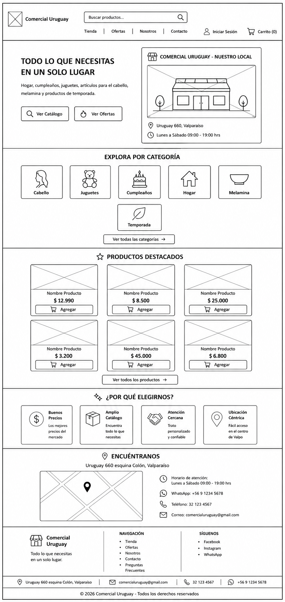
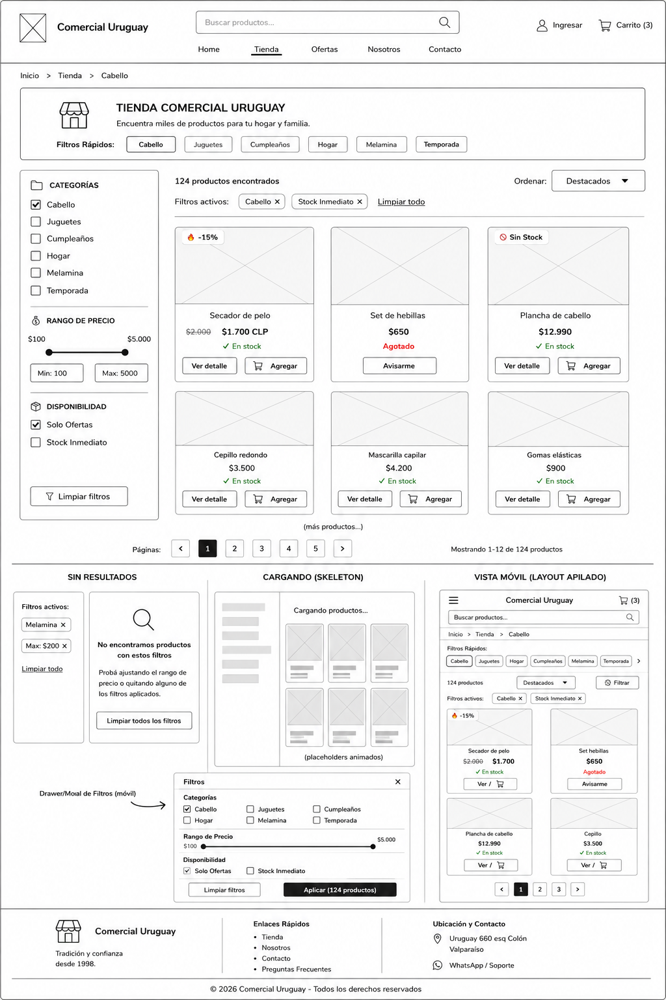
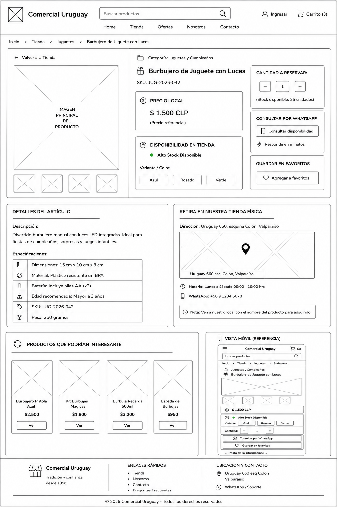
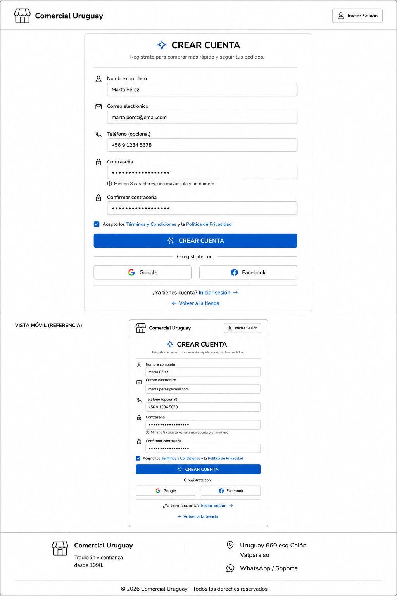
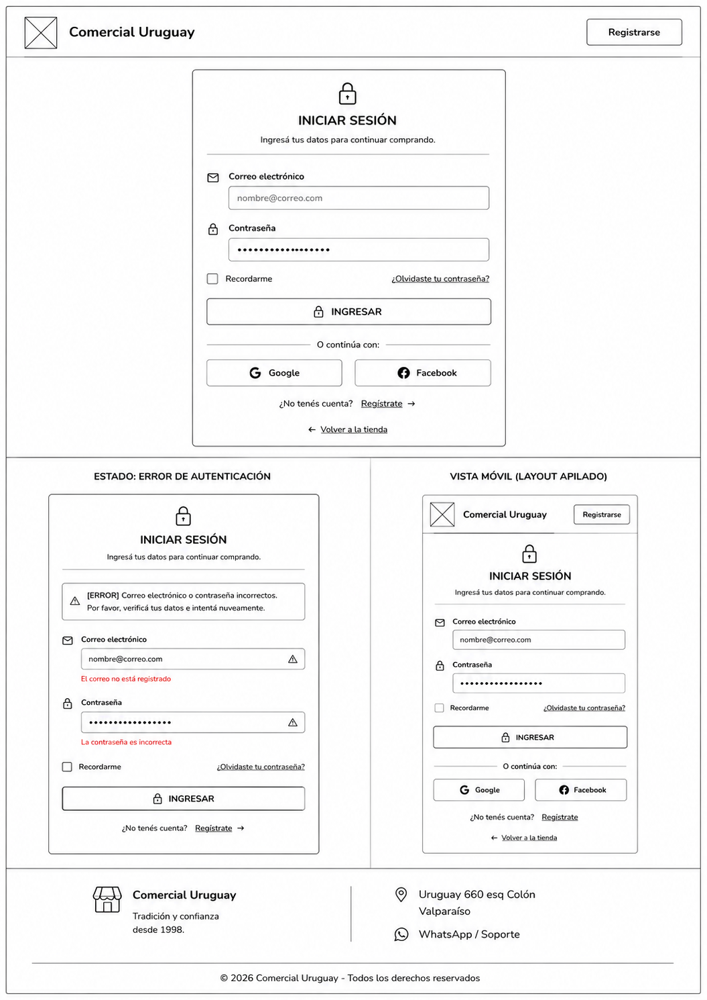
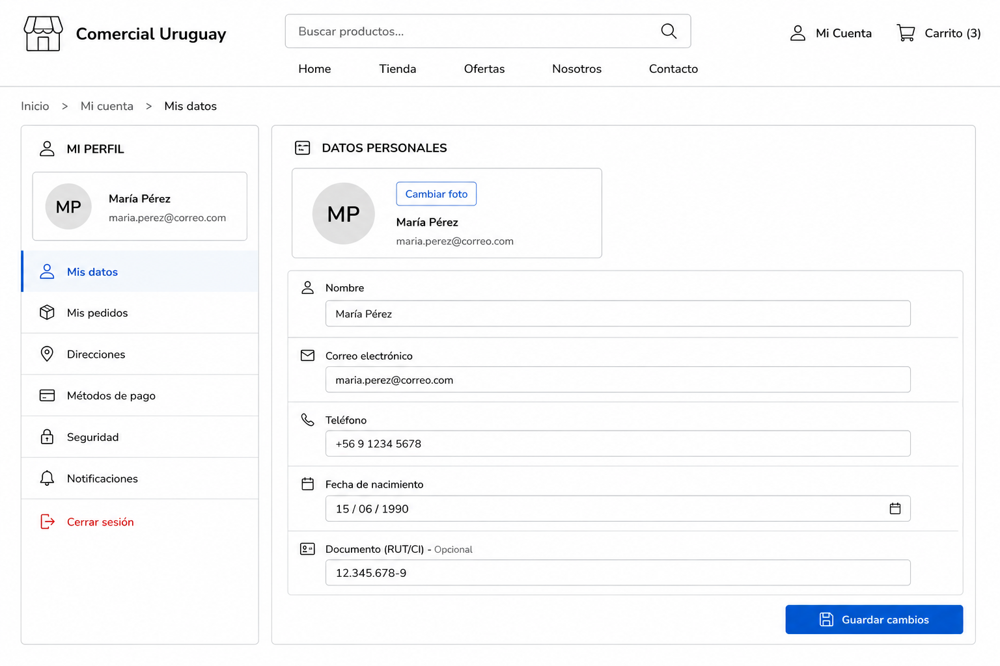
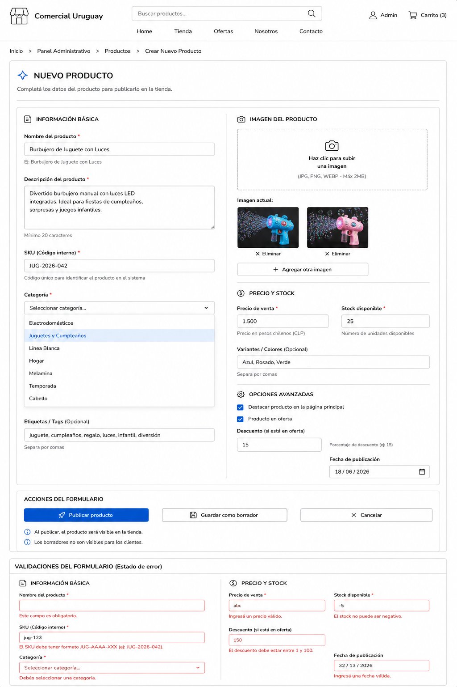

Boceto de Vistas del Proyecto

Este documento detalla la estructura visual de las pantallas del sistema. Aquí está:

1. Home

Página de aterrizaje (landing page) que presenta la propuesta de valor del proyecto.

    Boceto:
    

2. Tienda / Galería / Vitrina

Vista principal donde se despliegan los artículos o publicaciones disponibles para la comunidad.

    Boceto:
    

3. Detalle de Publicación

Vista dedicada a mostrar la información completa, imágenes y detalles de un ítem seleccionado.

    Boceto:
    

4. Registro

Formulario para que nuevos usuarios puedan unirse a la plataforma.

    Boceto:
    

5. Login

Pantalla de autenticación para que los usuarios registrados accedan a sus sesiones.

    Boceto:
    

6. Mi Perfil

Área privada donde el usuario gestiona sus datos personales y preferencias de cuenta.

    Boceto:
    

7. Crear Publicación

Formulario para que el usuario pueda publicar nuevos artículos o contenido en la plataforma.

    Boceto:
    
