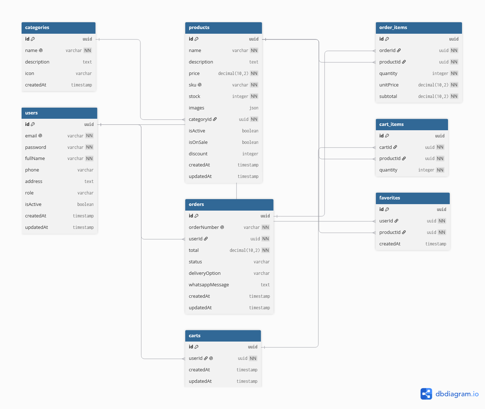

# PUNTO 4 - DISEÑO DE TABLAS DE BASE DE DATOS

## COMERCIAL URUGUAY - MARKETPLACE

---

## DIAGRAMA DE BASE DE DATOS

---

## TABLAS

- **users**: Usuarios del sistema (clientes y administradores)
- **categories**: Categorías de productos
- **products**: Catálogo de productos
- **orders**: Pedidos realizados por los clientes
- **order_items**: Productos dentro de cada pedido
- **carts**: Carrito de compras por usuario
- **cart_items**: Productos dentro del carrito
- **favorites**: Productos favoritos de cada usuario

---

## RELACIONES

| Relación               | Tipo  |
| ---------------------- | ----- |
| users → orders         | 1 a N |
| users → favorites      | 1 a N |
| users → carts          | 1 a 1 |
| categories → products  | 1 a N |
| products → order_items | 1 a N |
| orders → order_items   | 1 a N |
| carts → cart_items     | 1 a N |
| products → favorites   | 1 a N |

---

## ENUMS

| Enum           | Valores                                                                   |
| -------------- | ------------------------------------------------------------------------- |
| Role           | `CLIENTE`, `ADMIN`                                                        |
| OrderStatus    | `RECIBIDO`, `REVISION`, `CONFIRMADO`, `ENVIADO`, `ENTREGADO`, `CANCELADO` |
| DeliveryOption | `RETIRO_TIENDA`, `ENVIO_DOMICILIO`                                        |

---

© 2026 Comercial Uruguay - Todos los derechos reservados
